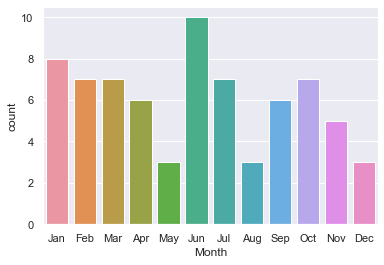
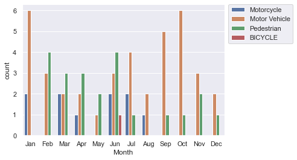
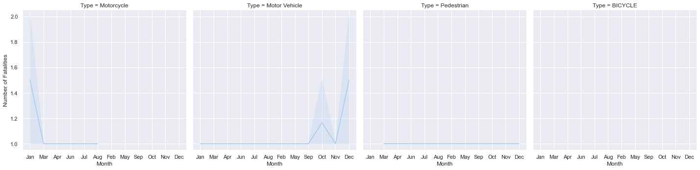
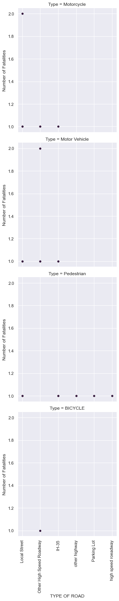
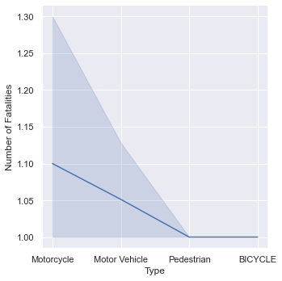

```python
import pandas as pd
import matplotlib.pyplot as plt
import ssl 
import seaborn as sns
import sweetviz as sv

filepath = "https://data.austintexas.gov/api/views/vggi-9ddh/rows.csv?accessType=DOWNLOAD"
ssl._create_default_https_context = ssl._create_unverified_context

df = pd.read_csv(filepath, skiprows=0)

print(df.columns)
```

    Index(['Type', 'FATAL CRASH #', 'Number of Fatalities', 'CASE NUMBER',
           'LOCATION', 'AREA', 'Date', 'Month', 'Day', 'Hour', 'Time', 'Related',
           'Killed: Driver/Pass', 'speed', 'Ran Red Light',
           'Drivers License Status', 'SUSPECTED IMPAIRMENT', 'restraint or helmet',
           'TYPE OF ROAD', 'FTSRA', 'XCOORD', 'YCOORD'],
          dtype='object')
    


```python
analyze_report = sv.analyze(df)
analyze_report.show_html('analyze.html', open_browser=False)
```


                                                 |                                             | [  0%]   00:00 ->…


    Report analyze.html was generated.
    


```python
sns.set_palette("rocket")
sns.countplot(x="Month", data=df)
plt.show()
```


    

    


```python
pip install sweetviz
```

    Collecting sweetviz
      Downloading sweetviz-2.1.3-py3-none-any.whl (15.1 MB)
    Requirement already satisfied: scipy>=1.3.2 in c:\users\earth\anaconda3\lib\site-packages (from sweetviz) (1.7.1)
    Collecting importlib-resources>=1.2.0
      Downloading importlib_resources-5.4.0-py3-none-any.whl (28 kB)
    Requirement already satisfied: matplotlib>=3.1.3 in c:\users\earth\anaconda3\lib\site-packages (from sweetviz) (3.4.3)
    Requirement already satisfied: pandas!=1.0.0,!=1.0.1,!=1.0.2,>=0.25.3 in c:\users\earth\anaconda3\lib\site-packages (from sweetviz) (1.3.4)
    Requirement already satisfied: numpy>=1.16.0 in c:\users\earth\anaconda3\lib\site-packages (from sweetviz) (1.20.3)
    Requirement already satisfied: tqdm>=4.43.0 in c:\users\earth\anaconda3\lib\site-packages (from sweetviz) (4.62.3)
    Requirement already satisfied: jinja2>=2.11.1 in c:\users\earth\anaconda3\lib\site-packages (from sweetviz) (2.11.3)Note: you may need to restart the kernel to use updated packages.
    
    Requirement already satisfied: zipp>=3.1.0 in c:\users\earth\anaconda3\lib\site-packages (from importlib-resources>=1.2.0->sweetviz) (3.6.0)
    Requirement already satisfied: MarkupSafe>=0.23 in c:\users\earth\anaconda3\lib\site-packages (from jinja2>=2.11.1->sweetviz) (1.1.1)
    Requirement already satisfied: pyparsing>=2.2.1 in c:\users\earth\anaconda3\lib\site-packages (from matplotlib>=3.1.3->sweetviz) (3.0.4)
    Requirement already satisfied: pillow>=6.2.0 in c:\users\earth\anaconda3\lib\site-packages (from matplotlib>=3.1.3->sweetviz) (8.4.0)
    Requirement already satisfied: cycler>=0.10 in c:\users\earth\anaconda3\lib\site-packages (from matplotlib>=3.1.3->sweetviz) (0.10.0)
    Requirement already satisfied: kiwisolver>=1.0.1 in c:\users\earth\anaconda3\lib\site-packages (from matplotlib>=3.1.3->sweetviz) (1.3.1)
    Requirement already satisfied: python-dateutil>=2.7 in c:\users\earth\anaconda3\lib\site-packages (from matplotlib>=3.1.3->sweetviz) (2.8.2)
    Requirement already satisfied: six in c:\users\earth\anaconda3\lib\site-packages (from cycler>=0.10->matplotlib>=3.1.3->sweetviz) (1.16.0)
    Requirement already satisfied: pytz>=2017.3 in c:\users\earth\anaconda3\lib\site-packages (from pandas!=1.0.0,!=1.0.1,!=1.0.2,>=0.25.3->sweetviz) (2021.3)
    Requirement already satisfied: colorama in c:\users\earth\anaconda3\lib\site-packages (from tqdm>=4.43.0->sweetviz) (0.4.4)
    Installing collected packages: importlib-resources, sweetviz
    Successfully installed importlib-resources-5.4.0 sweetviz-2.1.3
    


```python

```


```python
sns.set_theme(style="darkgrid")
sns.countplot(x="Month", data=df, hue="Type",)
plt.legend(bbox_to_anchor=(1.02, 1), loc='upper left', borderaxespad=0)
plt.show()
```


    

    


```python

sns.relplot(x="Month",y="Number of Fatalities", data=df,kind="line",col="Type")
plt.show()
```


    

    


```python
sns.relplot(x="TYPE OF ROAD",y="Number of Fatalities", data=df,kind="scatter",row="Type")
plt.xticks(rotation=90)
plt.show()
```


    

    


```python
sns.relplot(x="Type",y="Number of Fatalities",data=df, kind="line")
plt.show()
```


    

    

